# Top 18 Marketplace Software Rankings in 2025 (Latest Updated)

Launching a marketplace can feel overwhelming when you're stuck choosing between expensive custom development and limited cookie-cutter solutions. Whether you're building a rental platform, service marketplace, or product exchange, the right software can mean the difference between launching in days versus spending months in development limbo. This guide walks you through proven marketplace builders that handle everything from vendor onboarding to payment processing, helping you pick the platform that actually fits your timeline, budget, and vision.

## **[Sharetribe](https://www.sharetribe.com)**

Platform designed for founders launching service, rental, or product marketplaces without coding knowledge, offering both no-code launch and infinite customization through code.

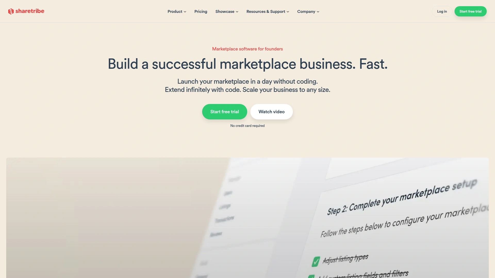

Built specifically for marketplace entrepreneurs who need speed without sacrificing flexibility. The platform lets you launch a functional marketplace within a day using pre-built templates, then extend it infinitely when your business demands unique features. Sharetribe handles the heavy lifting—availability management for rentals, secure payment splits through Stripe Connect, messaging between users, and two-sided review systems that build trust.

What sets it apart is the dual approach: start with their no-code builder to test your idea quickly, then tap into their headless architecture when you're ready for custom workflows or unique designs. The transaction engine automatically handles the complex dance of payments between buyers, sellers, and your platform. Thousands of founders across 70+ countries have used it to validate marketplace ideas, from equipment rentals to local services, because it removes the technical barriers that usually require a full development team.

Perfect for testing marketplace concepts rapidly, scaling rental or booking platforms where availability calendars matter, or building service marketplaces that need flexible transaction flows. The hosted cloud infrastructure means your platform performs regardless of user volume.

## **[CS-Cart Multi-Vendor](https://www.cs-cart.com/multivendor)**

Self-hosted marketplace platform offering extensive built-in features for product-focused marketplaces, with full source code ownership and no transaction fees on your sales.

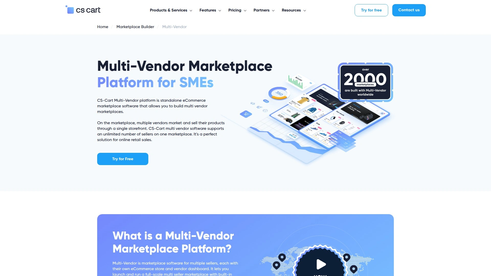

This PHP-based solution comes loaded with everything needed to run a product marketplace from day one—unlimited vendor support, bulk product uploads, flexible promotion systems, native mobile apps for Android and iOS, and sophisticated commission structures that work globally. Each vendor gets their own storefront with advanced inventory management, essentially operating separate stores under your marketplace umbrella.

The platform shines in international operations with multi-currency support, translation to any language, and hundreds of ready-to-use integrations for local payment and shipping services. Unlike subscription models, CS-Cart uses a one-time payment structure with complete source code access, meaning developers can customize everything to match specific business requirements.

Particularly strong for businesses wanting deep customization options, retailers expanding globally who need multi-language and multi-currency from the start, or companies with technical teams who can leverage the extensive addon marketplace. The trade-off is you'll need developer support for setup and modifications, but you gain complete control without recurring platform fees.

## **[Bubble.io](https://bubble.io)**

Visual programming platform enabling non-technical founders to build fully custom marketplace apps with complex workflows, user authentication, and integrated payment systems without writing code.

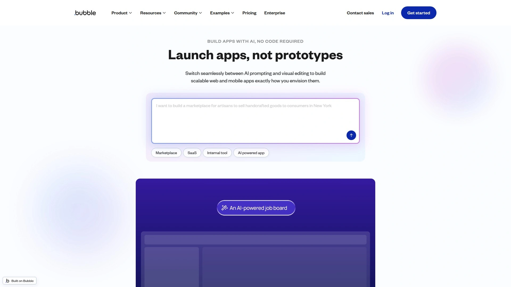

Bubble fundamentally changes who can build marketplace technology. Through drag-and-drop interface design and visual workflow creation, founders construct everything from basic listing platforms to sophisticated B2B marketplaces with unique features tailored to their exact market needs. The platform handles the backend complexity—user authentication, database management, Stripe Connect integration for marketplace payments, and scalable hosting.

The real power emerges in customization freedom. Unlike template-based builders, Bubble lets you design every aspect of user experience, create conditional logic for complex scenarios, and build APIs to connect with any external service. Marketplace founders use it to implement custom rating systems, build unique vendor dashboards, and create specialized search functionalities that template platforms simply can't offer.

Best suited for founders with specific marketplace visions that don't fit standard templates, complex B2C or B2B platforms requiring custom workflows, or businesses needing tight integration with existing systems. The learning curve is steeper than pure no-code options, but the payoff is a marketplace that behaves exactly as you envision. Many successful marketplaces have launched on Bubble, proving it can handle serious transaction volume when built correctly.

## **[Yo!Kart](https://www.yo-kart.com)**

Self-hosted multi-vendor eCommerce software with one-time licensing and 12 months of technical support, eliminating recurring subscription costs while providing complete platform ownership.

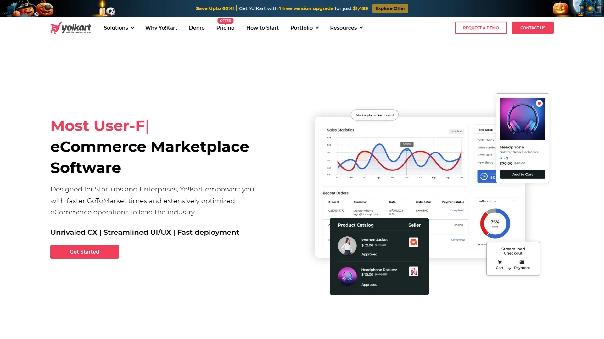

Yo!Kart delivers a turnkey marketplace solution through a unique business model—pay once, own forever. The platform includes separate dashboards for administrators and vendors, comprehensive analytics, inventory management tools, and mobile apps for both Android and iOS. Over 5,000 businesses globally have deployed it across industries from fashion to electronics to B2B marketplaces.

The software supports sophisticated commerce needs right out of the box: abandoned cart recovery, customizable commission structures (global, vendor-specific, category-based, or product-level), reward programs, smart product recommendations, and multiple payment gateway integrations. Vendors manage their storefronts independently while you maintain centralized control through a unified admin panel.

Ideal for startups and enterprises seeking to avoid monthly platform fees, businesses building niche marketplaces in specific industries like luxury goods or digital products, or companies wanting full code access for extensive customization. The upfront investment is higher than subscription models, but eliminates ongoing platform costs as your marketplace scales. FATbit Technologies backs it with nearly two decades of marketplace development experience.

## **[Dokan](https://dokan.co)**

WordPress-based WooCommerce plugin transforming existing WordPress sites into multi-vendor marketplaces in under 30 minutes, trusted by over 60,000 marketplaces worldwide.

Dokan takes the familiar WordPress ecosystem and adds complete marketplace functionality through seamless WooCommerce integration. Vendors get frontend dashboards where they control everything—product listings, order management, coupon creation, sales reports—without needing backend access. The plugin supports all product types: physical goods, digital downloads, variable products, and through extensions, even bookings and auctions.

The marketplace owner maintains full control while vendors operate autonomously. Set commission rates globally, by category, or per vendor. Over 100 payment gateway integrations enable automatic payment distribution, calculating and distributing payouts with commissions already deducted. The shipping system lets vendors configure their own zones and methods, giving them flexibility while keeping your marketplace competitive.

Perfect for businesses already invested in the WordPress ecosystem, entrepreneurs wanting the cost-effectiveness of open-source software with premium extensions available, or marketplaces needing extensive third-party integrations since WordPress has plugins for virtually everything. The combination of frontend vendor control and admin-only backend access creates a secure, scalable environment. With 38+ modules available, you can customize marketplace functionality to match your specific industry needs.

## **[Arcadier](https://www.arcadier.com)**

Cloud-based SaaS marketplace builder offering templated deployments with enterprise-grade security, supporting B2B, B2C, and P2P models across various industries.

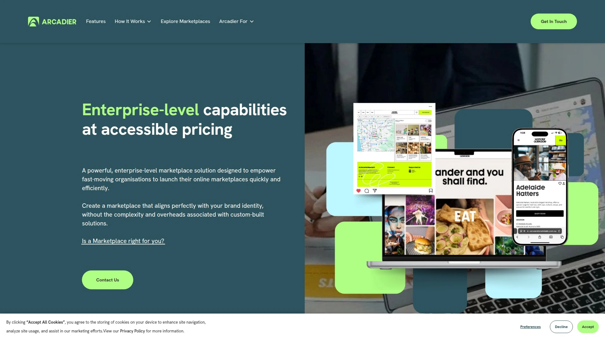

Arcadier provides fast marketplace launches through pre-built templates while maintaining customization flexibility through headless architecture and robust APIs. The platform handles retail, service bookings, rentals, and digital health marketplaces with industry-specific solutions for automotive, real estate, retail, and economic development.

Key advantages include zero transaction fees on top of payment processing, enhanced features like VIN lookup for automotive marketplaces, location-based search for local businesses, and customizable listing pages. The API-first approach means you can create custom front-end experiences while Arcadier handles the complex backend operations—vendor management, payment splitting, order fulfillment, and catalog management.

Best for enterprises wanting quick deployment without managing servers, businesses needing both standard templates and custom development paths, or marketplaces requiring specialized features for specific industries. The platform scales from small startups to large operations, with hosting and security handled entirely by Arcadier. While some users report the Express version has limitations, the enterprise platform provides comprehensive marketplace functionality.

## **[Mirakl](https://www.mirakl.com)**

Enterprise-grade marketplace and dropship SaaS platform chosen by Fortune 500 companies for complex, high-volume multi-vendor operations and B2B wholesale models.

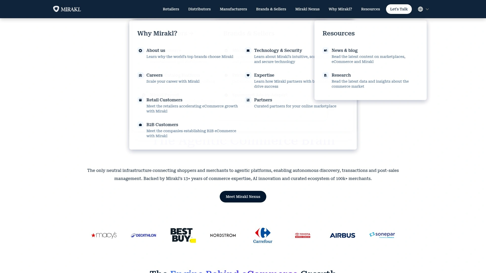

Mirakl represents the heavyweight option for serious marketplace operations. The platform uses AI for catalog management—automatically categorizing products, deduplicating listings, optimizing descriptions, and organizing offers under single product hierarchies. This creates richer product data and better buyer experiences at scale.

The system handles unified dropship and marketplace operations, letting companies sell products from multiple brands through one storefront with integrated fulfillment services. Advanced features include seller performance dashboards, automated product data mapping for streamlined vendor onboarding, integrated promotions and advertising capabilities, and sophisticated analytics for marketplace monitoring.

Designed exclusively for large retailers, manufacturers, and wholesalers managing thousands of vendors and products, B2B distributors needing complex procurement workflows, or established companies adding marketplace models to existing eCommerce operations. The platform integrates seamlessly with ERP, CRM, WMS, 3PL, and POS systems, working with your existing tech stack rather than replacing it. Mirakl's team of 180+ eCommerce consultants brings expertise from Amazon, Walmart, McKinsey, and major enterprises.

Pricing is custom based on business size and volume—this is not a startup-budget solution, but rather an investment for companies processing significant transaction volumes.

## **[Kreezalid](https://www.kreezalid.com)**

No-code marketplace builder launching functional platforms in minutes, specialized for products, services, and rental marketplaces with integrated payment solutions from Mangopay and Stripe Connect.

Kreezalid removes the technical barrier entirely. Within minutes, you can create a marketplace supporting physical products, digital goods, services, or rentals. The platform provides automated transactional emails, unified dashboard for managing users and listings, customizable categories and listing types, and built-in escrow and commission management.

The software handles user groups and attributes for customized experiences, vendor profiles with personal frontstores, dedicated vendor dashboards for sales tracking, and comprehensive search functionality with location, keywords, categories, and date filters. For scaling, Kreezalid offers an app store with plugins you can activate on-demand, theme store for design enhancements, and API access for building custom features.

Suited for entrepreneurs wanting the fastest path from idea to live marketplace, businesses testing marketplace concepts before investing heavily, or small to midsize companies needing all core marketplace features without custom development. The 14-day free trial lets you fully explore the platform. While it may lack some advanced features of enterprise platforms, Kreezalid delivers the essential 99% of marketplace functionality most businesses actually need.

## **[Nautical Commerce](https://www.nauticalcommerce.com)**

Multi-vendor commerce platform built specifically for marketplace transactions from the ground up, offering both no-code storefront builder and headless infrastructure for custom designs.

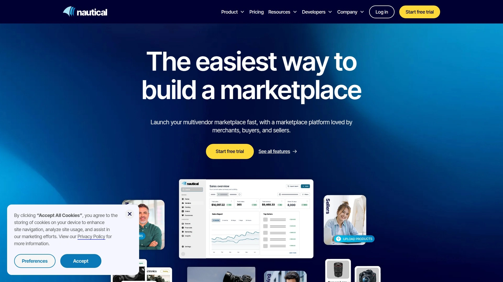

Nautical eliminates the need for underlying single-vendor eCommerce platforms. The system natively handles product information, order management, vendor management, contract lifecycle, payments orchestration, and logistics orchestration—all designed specifically for multi-vendor scenarios.

The all-new platform announced in 2025 makes launching marketplaces fast and affordable with simple self-guided vendor onboarding, quick product imports from existing stores, dedicated seller portals with performance insights, and native integrations with Shopify, Klaviyo, Yotpo, and Zapier. The central operations dashboard provides complete marketplace visibility.

Ideal for retailers and brands adding marketplace models to existing businesses, B2B companies managing wholesale or bulk distributor models like Alibaba or Faire, entrepreneurs building curated niche marketplaces to capture the 70% of shoppers who prefer specialized stores over massive general marketplaces, or businesses wanting both quick launch and eventual custom design control.

Nautical's headless approach means you can start with their storefront builder and migrate to custom front-ends as your business matures, without rebuilding backend infrastructure.

## **[Vendo](https://www.getvendo.com)**

All-in-one SaaS enabling marketplace launches in dropshipping model with automated vendor onboarding from Shopify, WooCommerce, and Magento stores in minutes.

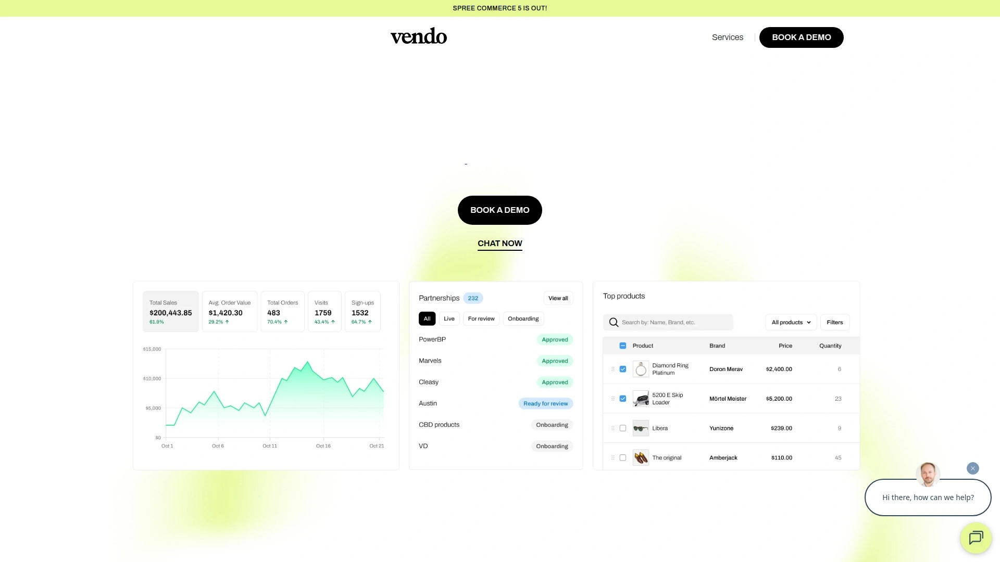

Vendo automates the tedious parts of running a marketplace. Vendors on Shopify, WooCommerce, or Magento can onboard their entire catalogs automatically. The platform then handles catalog sync, inventory updates, order routing to correct vendors, tracking information flow, payment splitting, and automated vendor payouts.

The built-in storefront is configurable and ready to launch within days, a fraction of custom development costs and timelines. For businesses with development teams, Vendo's headless, API-first architecture supports custom storefronts using Next.js or Vue Storefront starters, or integration into existing applications. Key features include bulk product catalog management via CSV, unified marketplace shipping methods (like site-wide free shipping over $50 with vendor reimbursement), and powerful integrations with Stripe Connect, Klaviyo, Segment, Aftership, Algolia, and TaxJar.

Perfect for entrepreneurs wanting to launch marketplace businesses quickly without managing inventory, businesses adding marketplace models alongside existing operations, or companies needing reliable, scalable infrastructure without time-consuming custom development. Vendo starts with a free plan, making it accessible for testing concepts before scaling.

## **[Tangram](https://www.tangram.co)**

Marketplace infrastructure delivering functional MVPs in 7 days for $199, integrated with Webflow for custom designs while handling backend complexity, payments, and user management.

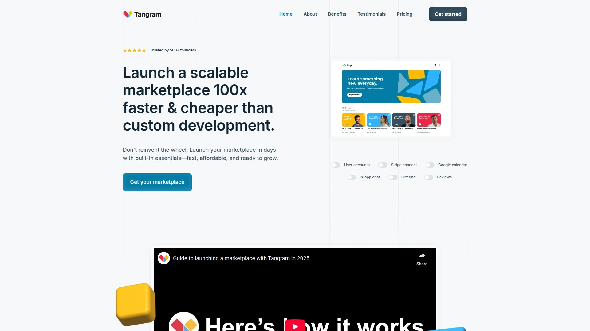

Tangram targets the sweet spot between no-code simplicity and custom functionality. Over 500 marketplaces have launched using it, saving founders millions in development costs and tens of thousands of hours. The platform provides the core 90% of marketplace functionality instantly—user logins, payments, scheduling, verification, booking systems—so founders focus on their unique value proposition.

The Webflow integration is key. Design your marketplace interface in Webflow with complete creative control, while Tangram manages the complex infrastructure: user databases with privacy controls, payment processing and checkout flows, in-app messaging with email and SMS notifications, vendor dashboards, and transaction management.

Best for founders wanting custom designs without developer costs, service marketplaces like job boards, class bookings, or expert directories, or businesses validating concepts before major investment. The $199/month subscription includes custom design and functionality during free trial, with 30-day money-back guarantee. Compared to the average $24,000 and four months for traditional development, Tangram's speed and cost make it accessible for early-stage ventures.

## **[Spree Commerce](https://spreecommerce.org)**

Open-source eCommerce framework built on Ruby on Rails, offering complete customization freedom for building unique marketplace experiences with flexible architecture.

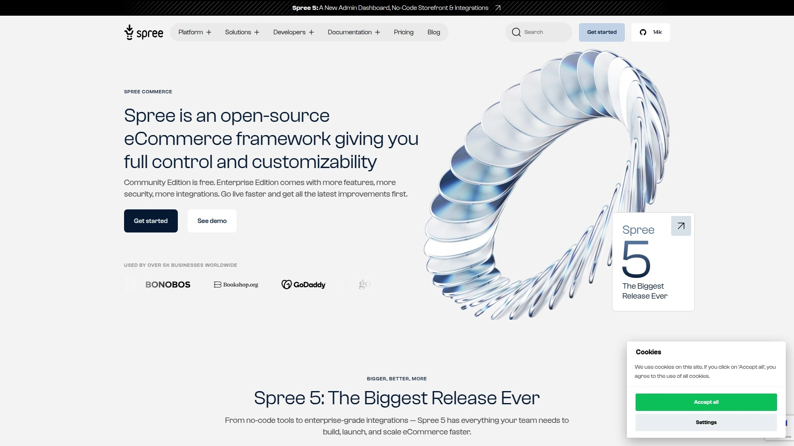

Spree gives developers maximum control. The modular structure simplifies customization and upgrades, letting technical teams build distinctive marketplace solutions tailored precisely to business needs. With over 2.4 million downloads, 13,200+ GitHub stars, and 845 contributors, Spree has proven itself in production at scale.

Notable marketplaces built on Spree include Garmentory (fashion marketplace that grew traffic by 3,000% and customer base by 300% year-over-year), Finery London (attracted 100,000 customers and £5 million in first year), and Violet Grey (luxury beauty platform reaching cult status). These successes demonstrate Spree's capability for fast-growing, high-volume operations.

Advanced features include AI-driven predictive search using browsing history, enhanced reporting with Google Analytics 4 integration, global payment support including cryptocurrencies, subscription and membership management with dynamic benefits, automated order management with fraud detection, and dynamic pricing based on demand or customer tier.

Suited for businesses with development teams wanting complete customization freedom, marketplaces requiring specific features that SaaS platforms don't offer, or companies building unique shopping experiences in niche markets. Vendo offers an enterprise version of Spree with additional security, privacy, and managed hosting for teams wanting Spree's flexibility without managing infrastructure.

## **[Webkul Multi Vendor Marketplace](https://store.webkul.com)**

Cross-platform marketplace solution available for Shopify, Magento, WooCommerce, PrestaShop, OpenCart, and Laravel, supporting diverse models from hyperlocal to B2B.

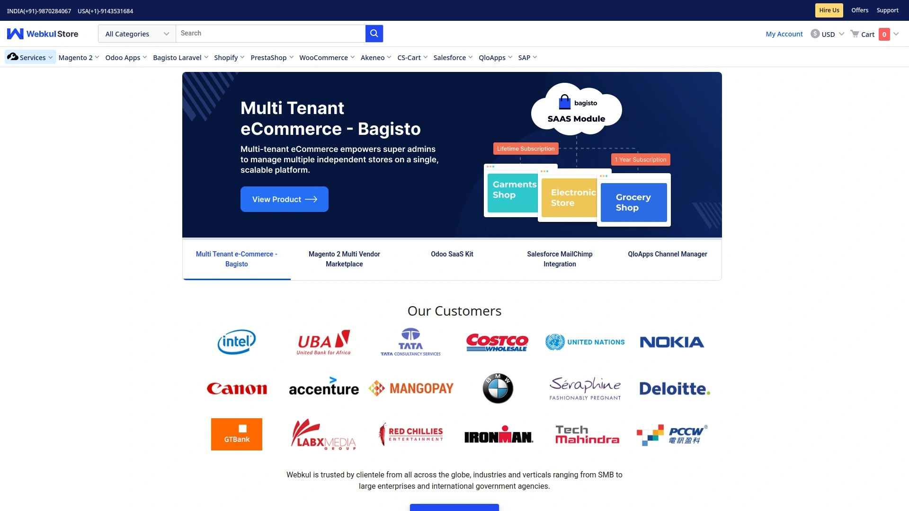

Webkul's strength lies in platform versatility. Whether your business runs on Shopify, Magento, WooCommerce, or other major eCommerce platforms, Webkul provides multi-vendor functionality that integrates directly. The solution includes mobile apps for Android and iOS, vendor-specific and global commission settings, product-level and category-level commission options, bulk product uploads, and customizable seller login pages.

Features span automated order emails, seller badges, real-time chat between buyers and sellers, dual sync capabilities, API access, return merchandise authorization (RMA), and Liquid file customization for Shopify implementations. Sellers can sync with major platforms like Etsy and Magento through connector apps.

Ideal for existing eCommerce stores adding marketplace functionality, businesses operating across multiple platforms who need consistent multi-vendor capabilities, or companies wanting extensive customization options with developer support. The modular approach means you can add features as needed rather than paying for everything upfront. Webkul has been building marketplace solutions across different platforms for years, bringing that cross-platform expertise to each implementation.

## **[Near Me](https://www.near-me.com)**

White-label marketplace platform connecting buyers and sellers with complete customization through HTML/CSS access, state-of-the-art technology, and comprehensive support.

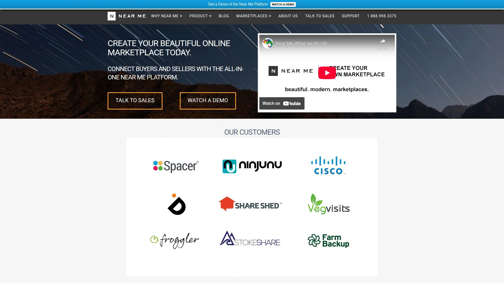

Near Me positions itself as an all-in-one solution handling the technical complexity so marketplace owners focus on customers. The platform includes secure payment processing, actionable analytics showing traffic, conversion, and sales at a glance, and experts who manage IT infrastructure freeing you to focus on business growth.

The platform's flexibility comes from full HTML/CSS access to your storefront, enabling completely custom designs that inspire and differentiate your marketplace from competitors. This level of customization typically requires expensive developers, but Near Me builds it into the platform.

Perfect for entrepreneurs wanting beautiful, unique marketplace designs without developer costs, service-based marketplaces needing booking and scheduling functionality, or founders who value responsive support (Near Me emphasizes their legendary customer service by phone or email). The platform has powered marketplaces across various categories—freelancer platforms, product marketplaces, services, and local directories.

While less prominent than some competitors, Near Me has been operating since 2015, demonstrating staying power in the marketplace software space.

## **[Marketplacer](https://www.marketplacer.com)**

Scalable platform designed for large businesses expanding into marketplace models, supporting both first-party and third-party sales through single dashboard.

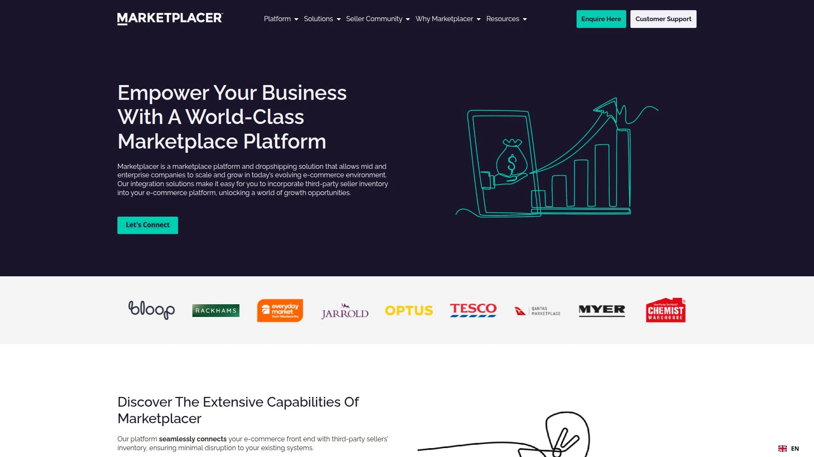

Marketplacer enables companies to manage vendors, process payments, and track orders from unified admin interfaces. The platform accommodates high transaction volumes while maintaining performance, making it suitable for retailers becoming Fortune 500-level marketplaces.

Key capabilities include support for both your own products and third-party vendor inventory, sophisticated vendor management and onboarding tools, scalability to handle growing transaction volumes, and integration with existing business systems. The platform requires developer support for setup and customizations but provides enterprise-level features for businesses at scale.

Best suited for large retailers adding marketplace channels to existing eCommerce operations, established brands wanting to expand product offerings through third-party sellers, or enterprises with technical resources to implement and manage the platform. Pricing is custom based on business size and requirements. Marketplacer focuses on the mid-to-large business segment rather than startups or small marketplaces.

## **[Softr](https://www.softr.io)**

No-code tool building marketplace websites from data in Airtable or Google Sheets, offering rapid deployment for founders testing marketplace concepts.

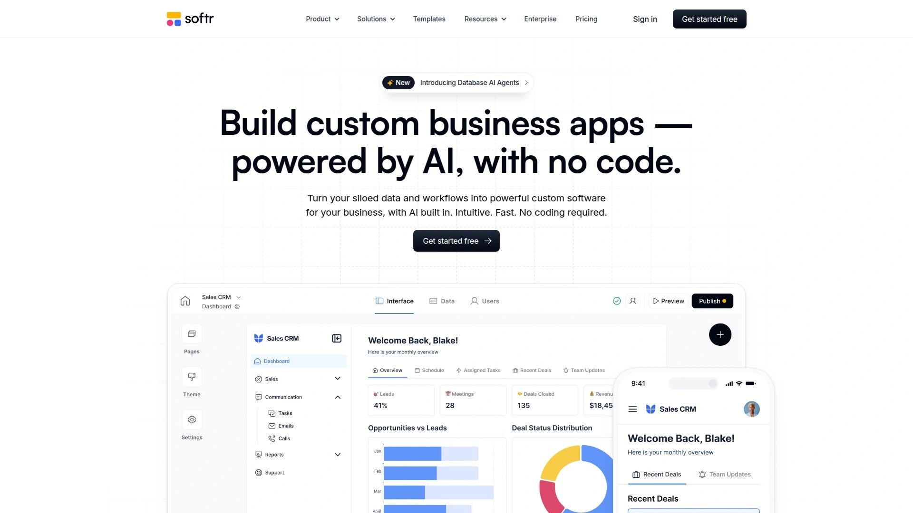

Softr converts spreadsheet data into functional marketplace websites. If your vendor information, product catalogs, or service listings live in Airtable or Google Sheets, Softr transforms that data into browsable, filterable marketplaces. The platform works particularly well for directory-style marketplaces, local service platforms, or any marketplace where the initial data structure fits spreadsheet organization.

Setup is extremely simple—connect your data source, choose design templates, and publish. The trade-off is less flexibility than code-based or full-featured marketplace builders. Softr excels at speed and simplicity for specific use cases but may not support complex transaction flows or advanced marketplace features.

Ideal for rapid marketplace concept validation, directory or listing sites where transactions happen off-platform, or internal marketplaces for organizations managing resources. The platform starts at $24/month, making it one of the most affordable options for simple marketplace needs. However, businesses requiring sophisticated commission management, complex payment splitting, or extensive vendor tools will likely outgrow Softr quickly.

## **[Cocorico](https://github.com/Cocolabs-SAS/cocorico)**

Open-source PHP marketplace framework specialized for service-based and rental marketplaces, offering advanced features like integrated calendars, booking management, and geolocation tracking.

Cocorico delivers sophisticated functionality specifically for service and rental use cases. The platform includes integrated event calendars, booking and availability management, third-party payment handling with deferred payments, client verification systems, geolocation and geofencing capabilities, and customizable commission structures.

As open-source software, Cocorico requires technical expertise to deploy and customize. The codebase, written in PHP Symfony and released under MIT license, provides complete control for development teams. Cocolabs created Cocorico to build complex marketplaces beyond what generic SaaS solutions offered, and that depth shows in the feature set.

Best for businesses building service or rental marketplaces similar to Airbnb or BlaBlaCar who want full control, companies with PHP development teams who can leverage the extensive codebase, or marketplaces needing advanced features like multi-vendor shopping carts or sophisticated booking flows. Cocorico has evolved into Second (www.scnd.com), a more powerful enterprise version for advanced marketplaces. The original Cocorico remains available as open-source for those wanting the code foundation.

## **[WCFM Marketplace](https://wcfm.com)**

Free WordPress marketplace plugin from the repository providing essential multi-vendor features with extensive control over transactions, policies, and vendor management.

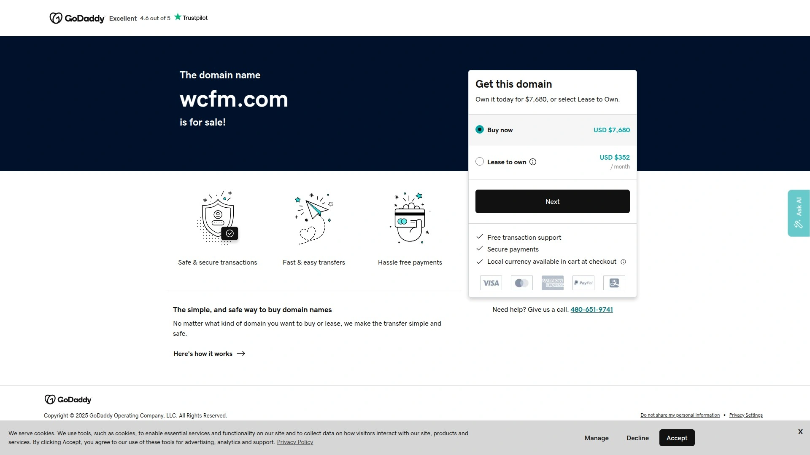

WCFM Marketplace offers remarkable functionality in its free version—flexible commissions, vendor registration, bulk uploads, comprehensive shipping control (by zone, country, distance, weight, zip code), and detailed financial tracking through the Ledger page showing orders, payouts, refunds, and charges.

The plugin gives marketplace owners significant control over operations. Set custom withdrawal rules and disbursements, enable reverse withdrawals for refunds, configure automatic or manual refund approvals, and restrict shipping by geography. Vendors manage store hours, vacation modes, SEO optimization, and shipping rates independently.

Premium add-ons expand functionality further—the WooCommerce Frontend Manager addon adds store hours, vacation settings, reviews, and more frontend management for vendors. The wide range of add-ons means you can start free and add capabilities as your marketplace grows.

Perfect for WordPress users wanting marketplace functionality without upfront costs, entrepreneurs testing marketplace concepts before investing in premium solutions, or small businesses needing solid multi-vendor features with room to grow. While some users report customer service could be better, the extensive free features and active WordPress community provide substantial support resources.

## **[Shipturtle](https://www.shipturtle.com)**

Shopify-specific multi-vendor marketplace app providing true C2C functionality with deep Shopify integration, syncing products, vendors, inventory, and costs automatically.

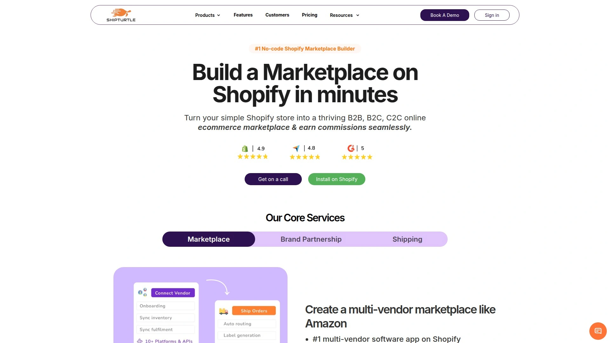

Shipturtle differentiates itself through complete Shopify integration rather than data duplication. The app instantly syncs products, vendors, HSN codes, weight, cost prices, and warehouses from your Shopify store, avoiding the data management headaches common in marketplace implementations.

Features include vendor type configuration (marketplace seller or dropshipper affecting invoicing and tax rules), order splitting and routing to correct vendors, multiple vendor shipping labels with tracking, separate invoicing for merchants and vendors, comprehensive seller dashboards showing performance, and extensive customization options.

Ideal for Shopify stores expanding into multi-vendor models, businesses wanting C2C marketplace functionality on Shopify (which Shipturtle uniquely provides), or marketplace owners needing tight integration with Shopify's ecosystem of apps and tools. Pricing scales with marketplace size, and the committed tech support helps troubleshoot the complex scenarios that arise in multi-vendor environments.

Shipturtle positions itself as the only truly integrated Shopify multi-vendor solution, and that integration depth matters for businesses serious about running marketplaces on Shopify.

## FAQ

**How quickly can I actually launch a marketplace using these platforms?**

Launch speed varies dramatically by platform complexity and your requirements. No-code options like Kreezalid or Sharetribe let you publish a basic marketplace within a day or two—create your account, customize colors and branding, set commission structures, and start inviting vendors. Platforms like Tangram deliver functional MVPs in about seven days with custom design work. Self-hosted solutions like Yo!Kart or CS-Cart typically need one to four weeks for setup, configuration, and testing. Enterprise platforms like Mirakl or Marketplacer require months for implementation due to extensive integrations with existing business systems. Start by clarifying whether you're testing an idea (choose fast, no-code options) or scaling an established business (invest time in robust platforms).

**What's the real difference between hosted SaaS platforms and self-hosted marketplace software?**

Hosted SaaS platforms (Sharetribe, Kreezalid, Arcadier) handle all technical infrastructure—servers, security, updates, backups—through monthly subscriptions. You get faster launches, automatic scaling as traffic grows, and no technical management burden, but you're limited to each platform's features and capabilities. Self-hosted solutions (Yo!Kart, CS-Cart, Cocorico) give you complete control and customization freedom with one-time licensing costs, but require technical expertise for setup, security management, server hosting, and ongoing maintenance. Choose hosted platforms for speed and simplicity; choose self-hosted when you need unique features, want to eliminate recurring fees, or have development resources to leverage full customization.

**How do these marketplace platforms handle payments between buyers, sellers, and my business?**

Most modern marketplace platforms integrate with Stripe Connect or Mangopay, which are specifically designed for marketplace payment splitting. When customers purchase, the payment gets divided automatically—your commission goes to your account, the vendor's portion to theirs, and payment processor fees are calculated transparently. Platforms like Dokan support over 100 payment gateways with automatic distribution and commission calculation. Enterprise solutions like Mirakl offer unified invoicing, credit limits, and multiple payment terms for complex B2B scenarios. Ensure your chosen platform supports payment methods your target market actually uses and operates legally in your target countries, as payment regulations vary significantly by region.

## Conclusion

Choosing marketplace software ultimately comes down to matching platform capabilities with your specific stage and vision. If you're validating a concept quickly, tools like **[Sharetribe](https://www.sharetribe.com)** or Tangram get you live in days without code. For established businesses scaling multi-vendor operations, CS-Cart or Yo!Kart provide comprehensive features with one-time costs. **[Sharetribe](https://www.sharetribe.com)** particularly stands out for rental and service marketplaces because it balances rapid no-code launching with the flexibility to add custom features as your marketplace grows—perfect for founders who want to start fast but need room to scale uniquely. The platforms covered here have all proven themselves with real marketplaces generating actual revenue, removing the technical barriers that used to require six-figure budgets and six-month timelines.
